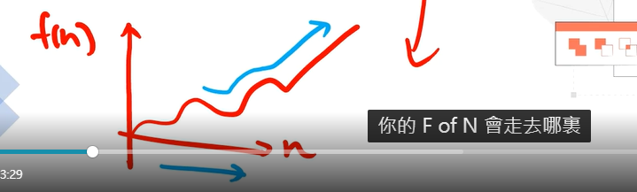
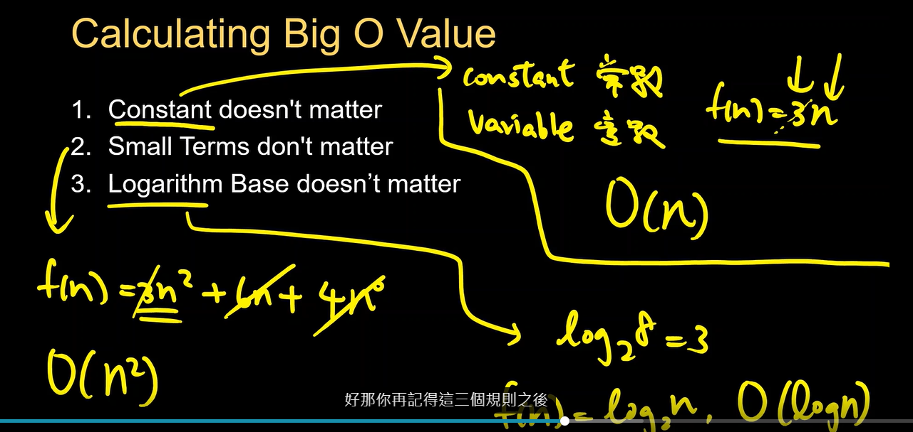

What is Algorithim?

1. Algorithm is a finite sequence of well-defined, computer-implementable instructions, typically to solve a class of problems or to pertorm a computation.
2. Easily apeaking algorithm is a step-by-step procedure to solve a problern.

Examples of  Algorthim in real life

1. How does Google Map find the shortest path?
2. How does YouTube know what videos you might want to watch, from 5 billion videos?
3. How does excel sheet sort your financial statements in either descending order or ascending order?
4. How does Facebook/Instagram know what friends you should add?

比較演算法

Is it important to compare algorithms?

If two different algorithms can accomplish the same task, then why do we care about which one is better?

What is Complexity?

1. When analyzing the complexity of an algorithm, we calcuate the (time or space) complexity.
2. Generally, every addition, subtraction, multiplication, division, comparison counts as one "poeration".
3. Complexity means given an input size, "how many operations do we need to perform in an algorithm?"
4. We use function f(n) to show the equation of complexity and input sizes.

Big  O Notation

1. Big O Notation is a tool that describe the limiting behavior of a function when the argument tends of a function when the argument tends towards a particular value or inifinty
2. Big O Notation has a "worst case scenario", which means it shows the general trends of complexity when the size of inputs is extremely large.

